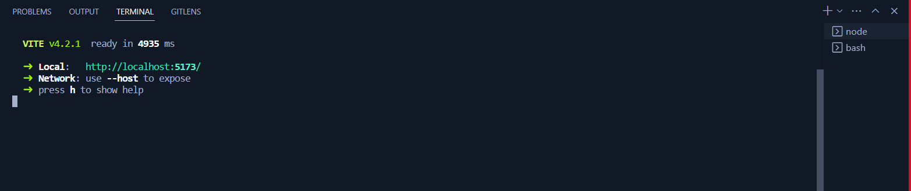
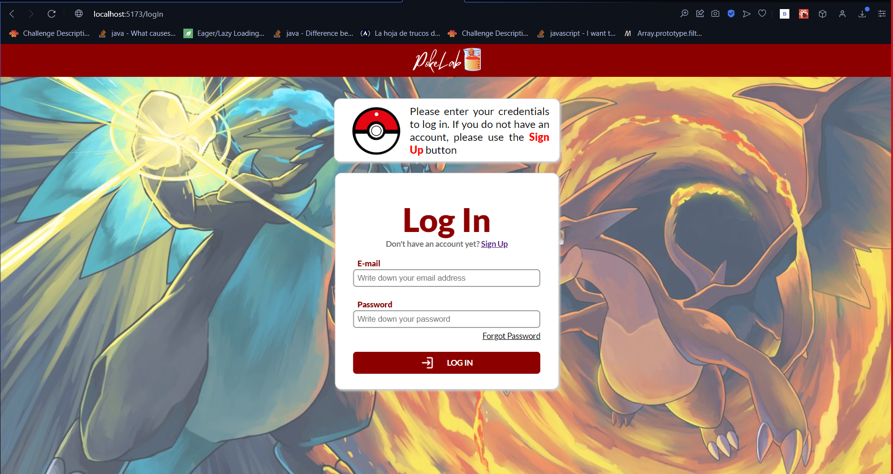

# Pokelab
A visual 

# Developed by:

- [Gabriel Nieves](https://github.com/gabrielnievescosson)
- [Andrés Pico](https://github.com/Jandres1420)

**Table of Contents**

- [Tools and libraries](#tools)
- [Instructions to run the application](#instructions)

## Tools


<br></br>

- React
- Vite

## Instructions.

Installations:
- Node.js
- pg Admin 4
- IntelliJ
- VS Code (or the code editor of your choice)

Procedure:
- Clone the [back-end repository](https://github.com/Jandres1420/Pokemon-Challengue-Back-End.git) and follow the README steps to run the Back-End
- Continue the steps to run the Front-End

### First Step

Clone this repository with

```bash
git clone https://github.com/gabrielnievescosson/Pokemon-development.git
```

### Second step

Type in the command line, or terminal, the Pokemon-development directory

```bash
cd {route}/Pokemon-development
```

### Third step

Install all the dependencies that the project needs using the following command:

```node
npm install
```

### Fourth step

Since the application was developed using Vite, use the following command:

```node
npm run dev
```

After successfully running the Back-End application and completing all the previous steps encountered in this document, you should be able to see this on the terminal



And the following screen on your browser of preference:


